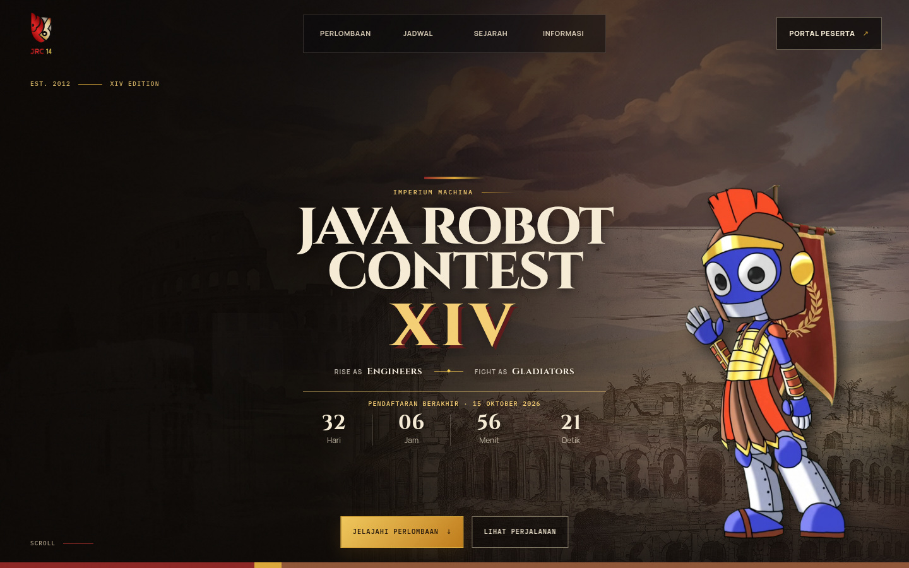
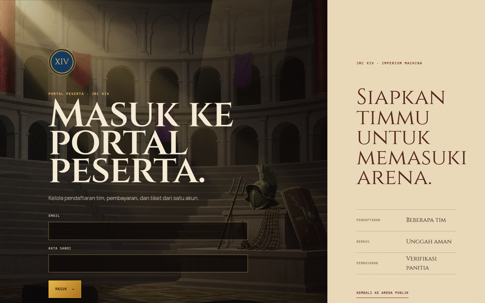
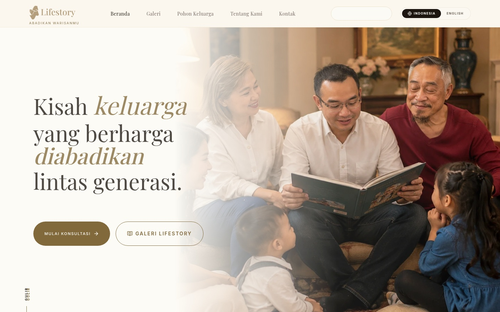
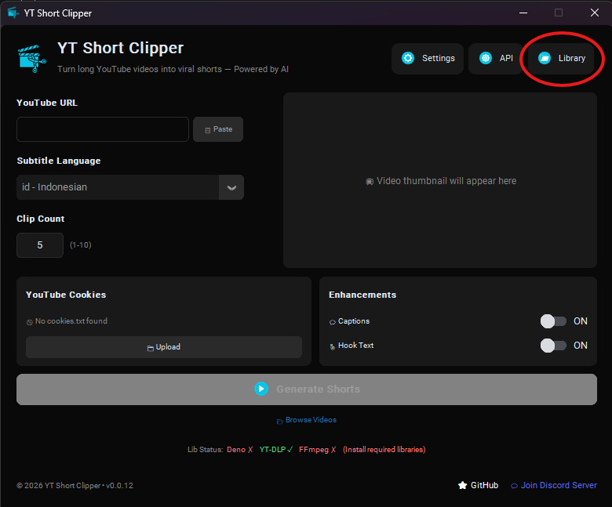
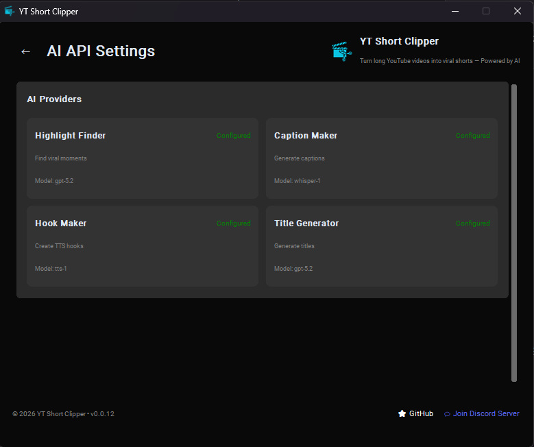

<!-- ORIGAMI // ANGEL COMMAND DECK — evidence-led profile -->

<div align="center">


<br/>

# `ANGEL COMMAND DECK // NAUFAL SHIDQI PURNOMO`

### Frontend & Product Developer

**Web systems · automation pipelines · digital learning**

I turn operational problems and product ideas into working digital systems — from visual interfaces and learning platforms to tested automation pipelines.

[**OPEN FEATURED PROJECTS ↓**](#-featured-deployments--verified-builds) · [**EMAIL**](mailto:naufalspurnomo@gmail.com) · [**LINKEDIN**](https://www.linkedin.com/in/naufal-shidqi-purnomo)

</div>

```text
╔══════════════════════════════════════════════════════════════════════════════╗
║  ORIGAMI // BUILDER DOSSIER                                    LINK: ONLINE  ║
╠══════════════════════════════════════════════════════════════════════════════╣
║  PRODUCT SURFACES  React · Next.js · Vue · TypeScript · responsive UI       ║
║  SYSTEMS           Admin portals · registration · payments · reporting       ║
║  AUTOMATION        Python · AI/LLM integration · OCR · media · PDF export    ║
║  LEARNING          LMS structure · course access · content operations        ║
╚══════════════════════════════════════════════════════════════════════════════╝
```


## ❖ `FEATURED DEPLOYMENTS // VERIFIED BUILDS`

> Four products where interface craft meets operational depth. Open the repositories, inspect the systems, then get in touch.

### `01 // JRC XIV EVENT PLATFORM`

[](https://github.com/Naufalspurnomo/jrc)

**One event. Three connected surfaces.** A public competition website connected to participant registration and administration workflows. The system combines cinematic interaction with document, payment, review, QR/scanning, and email flows.

`React 19` · `TypeScript` · `Vite` · `Tailwind CSS` · `GSAP` · `Zod` · `Vitest` · `Node.js`

- Designed the interface architecture across public, participant, and administration routes.
- Kept local demonstration adapters separable from production backend contracts.
- Used schema validation and automated tests to protect business-critical registration flows.

[**ACCESS REPOSITORY ↗**](https://github.com/Naufalspurnomo/jrc)

<details>
<summary><b>OPEN SECONDARY VIEW // PARTICIPANT PORTAL</b></summary>
<br/>

</details>

---

### `02 // LIFESTORY`

[](https://lifestory.co.id)

**A digital home for family stories, lineage, and memory.** A full-stack platform for preserving family history through interactive trees, biography archives, and collaborative editing.

`Next.js` · `TypeScript` · `PostgreSQL` · `Prisma` · `NextAuth` · `Vitest`

- Canvas-based family-tree visualization with layered layout.
- Owner, editor, and viewer collaboration roles.
- Offline-first sync with write-ahead logging, retries, conflict handling, and idempotent replay.
- Validated JSON and spreadsheet import/export, rolling snapshots, and point-in-time restore.

[**OPEN LIVE PRODUCT ↗**](https://lifestory.co.id) · [**ACCESS REPOSITORY ↗**](https://github.com/Naufalspurnomo/Lifestory)

<details>
<summary><b>OPEN SECONDARY VIEW // PRODUCT INTERFACE</b></summary>
<br/>

</details>

---

### `03 // FINANCE AUTOMATION`

```text
┌─ INPUT ─────────────┐   ┌─ DURABLE CORE ──────────┐   ┌─ OUTPUT ────────────┐
│ text · image capture│ → │ ledger · validation     │ → │ Sheets · analysis   │
│ amount extraction   │   │ replay · lifecycle tests│   │ PDF reporting       │
└─────────────────────┘   └─────────────────────────┘   └─────────────────────┘
```

A transaction and project-finance workflow that turns text or image inputs into structured records, analysis, and reports. Built around a durable processing pipeline rather than a one-shot AI response.

`Python` · `Flask` · `PostgreSQL` · `Google Sheets` · `PDF`

- Structured ledger with image/text capture and amount validation.
- Google Sheets and PostgreSQL integration.
- AI-assisted insights and PDF reports.
- Security, replay, and lifecycle tests.

[**ACCESS REPOSITORY ↗**](https://github.com/Naufalspurnomo/keuangan)

---

### `04 // AUTO-CLIPPER`

[](https://github.com/Naufalspurnomo/Auto-Clipper)

**From long-form gaming streams to packaged vertical clips.** An AI-assisted pipeline that detects candidate moments, classifies clip types, creates vertical compositions and captions, then applies quality gates.

`Python` · `OpenCV` · `OCR` · `Whisper` · `FFmpeg`

- Audio, motion, and OCR candidate detection.
- Six template-driven clip compositions with facecam-aware layouts and fallback modes.
- Whisper captions with terminology cleanup.
- Template, subtitle, layout, and audio quality control.

[**ACCESS REPOSITORY ↗**](https://github.com/Naufalspurnomo/Auto-Clipper)

<details>
<summary><b>OPEN SECONDARY VIEW // AI ANALYSIS</b></summary>
<br/>

</details>


## ❖ `BUILDER DOSSIER // BROADER PRACTICE`

### `DATA & RESEARCH TOOLING`

**YouTube Informal Learning Analyzer**<br/>
`Python · Streamlit · Pandas · NLP · LDA`

Research pipeline for collecting, cleaning, labeling, and analyzing Indonesian YouTube comments around informal learning in gaming communities. Covers metadata, comments and replies, Indonesian text preprocessing, rule-based sentiment and learning codes, topic modeling, charts, CSV, and Markdown reports.

### `LEARNING & VISUAL SYSTEMS`

- **Cherish LMS** — WordPress learning platform work spanning Masteriyo course flows, PHP/JavaScript/CSS customization, Midtrans integration, SEO, performance, and maintenance.
- **Family Biography Design** — React/Vite editorial prototype combining family archives, timeline storytelling, biography layouts, and an archive-inspired visual system.

### `ADDITIONAL BUILDS`

- **Multi-User AI Agent Routing** — Owner-isolated profiles, sessions, workspaces, browser/CLI identity, shared Telegram transport. `Python · Hermes architecture · TDD`
- **Toxic Comment Detector** — Indonesian text classification with preprocessing, model inference, and visual analysis. `Python · Streamlit · scikit-learn`
- **Project Amadeus** — Gesture- and face-controlled desktop interaction for media, browser, system, and vision modes. `Python · OpenCV · MediaPipe`


## ❖ `CAPABILITY MATRIX // WORKING LOADOUT`

```yaml
interface_systems:
  - React / Next.js
  - Vue.js
  - TypeScript / JavaScript
  - Tailwind CSS

product_engineering:
  - Node.js / REST APIs
  - PostgreSQL / Prisma
  - Authentication / payments
  - Git / automated testing

automation_and_learning:
  - Python
  - OCR / media processing
  - PHP / WordPress
  - LMS operations

delivery:
  - Docker / CI
  - Figma / UI
  - Production debugging
```


## ❖ `COMBAT TELEMETRY // GITHUB SIGNAL`

<div align="center">


<br/>


</div>

> Telemetry cards and the contribution matrix are refreshed by scheduled GitHub Actions.


## ❖ `ANGEL ROUTE // CONTRIBUTION MATRIX`

<div align="center">
<picture>
  
</picture>
</div>


## ❖ `SECURE CHANNEL // START A CONVERSATION`

<div align="center">

**Need a product interface, automation workflow, or digital learning system?**

[](mailto:naufalspurnomo@gmail.com)
[](https://www.linkedin.com/in/naufal-shidqi-purnomo)
[](https://github.com/Naufalspurnomo)

<br/>

`ANGEL SYSTEM // BUILD USEFUL THINGS WITH PRECISION`


</div>
