<!-- ORIGAMI // GENERAL-PURPOSE ANGEL HUD -->

### Frontend & Product Developer

**Web systems · automation · digital learning · multimedia and visual systems**

`BOOT: COMPLETE` · `LINK: STABLE` · `MODE: BUILDING`

## `01 // CURRENT DIRECTIVES`

> I design and build useful digital systems where interface craft, product thinking, and reliable implementation meet.

- **Interface systems** — responsive, accessible product surfaces with a clear visual identity.
- **Automation** — practical workflows that connect data, tools, media, and repeatable operations.
- **Digital learning** — learning experiences, content systems, and platform operations.
- **Visual systems** — multimedia, interaction, motion, and information made easier to understand.

## `02 // TECH LOADOUT`

<picture>
  <source media="(max-width: 600px)" srcset="./assets/angel-loadout-grid-mobile.svg" />
  
</picture>

## `03 // LIVE GITHUB TELEMETRY`

 

Real repository and contribution data. Refreshed by the profile telemetry workflow.

## `04 // CONTRIBUTION MATRIX`

<picture>
  
</picture>

## `05 // CONTACT TERMINAL`

**Open a channel for product interfaces, automation, digital learning, or visual systems.**

 

`ANGEL SYSTEM // READY FOR THE NEXT SIGNAL`

