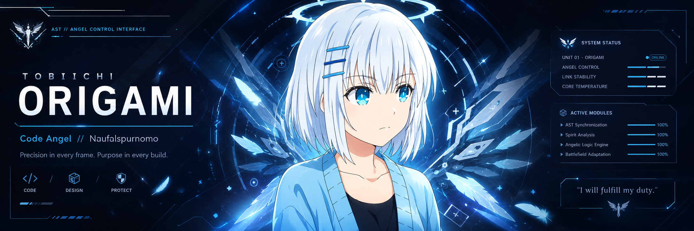
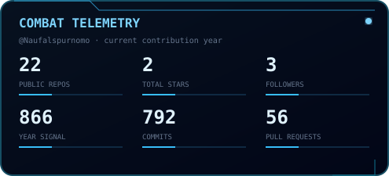
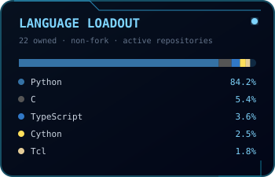

<!--
  ORIGAMI // ANGEL SYSTEM
  Fan-made GitHub profile theme for Naufalspurnomo.
  Main colors: #020617 #07111f #38bdf8 #7dd3fc #e0f2fe
-->

<div align="center">



<br/><br/>

<a href="https://git.io/typing-svg">
  
</a>

</div>

<br/>

```diff
+ SYSTEM BOOT SEQUENCE INITIATED...
! LOADING CORE MODULES: [WEB_ENGINE] [CREATIVE_DRIVE] [AI_LINK]
# AUTHORIZATION GRANTED: OPERATOR NAUFALSPURNOMO
```


<div align="center">

| ❖ `SYSTEM IDENTIFICATION` | ❖ `NETWORK TELEMETRY` |
|:---|:---|
| <br/><br/> | <br/><br/><br/><br/><br/><br/><br/> |

</div>


### ❖ `ANGEL CORE // SYSTEM STATUS`

<table>
<tr>
<td width="50%" valign="top">

```text
[ ██████████ ] 100% - METATRON CORE
[ █████████░ ]  92% - CREATIVE DRIVE
[ ████████░░ ]  84% - WEB ENGINE
[ ███████░░░ ]  76% - AI LINK
[ ██████░░░░ ]  68% - WEB3 SYNC
```

</td>
<td width="50%" valign="top">

**[ CURRENT DIRECTIVES ]**
- ✦ **Interactive Web:** Building dynamic frontend architectures.
- ✦ **AI Utilities:** Developing autonomous agents & smart workflows.
- ✦ **Creative Multimedia:** UI/UX, motion graphics, and 2D animation.
- ✦ **Blockchain:** Exploring smart contracts & Web3 integrations.

</td>
</tr>
</table>


### ❖ `ARMAMENT // CLASSIFIED TECH LOADOUT`

> *Accessing encrypted skill trees...*

<details>
<summary><b>[+] EXPAND: CORE DEVELOPMENT ENGINES</b></summary>
<br/>
<div align="center">

</div>
<br/>
</details>

<details>
<summary><b>[+] EXPAND: MULTIMEDIA & CREATIVE ARSENAL</b></summary>
<br/>
<div align="center">

</div>
<br/>
</details>

<details>
<summary><b>[+] EXPAND: INFRASTRUCTURE & AUTOMATION</b></summary>
<br/>
<div align="center">

<br/><br/>


</div>
<br/>
</details>


### ❖ `BATTLE DATA // COMBAT TELEMETRY`

<table width="100%">
<tr>
<td width="50%" align="center" valign="middle">

</td>
<td width="50%" align="center" valign="middle">

</td>
</tr>
</table>

<div align="center">
<br/>

</div>

> *Telemetry data secured. The local cards are refreshed by automated GitHub Actions to bypass public surveillance limits.*


### ❖ `MISSION BOARD // ACTIVE QUESTS`

```yaml
completed_missions:
  - id: 001
    title: "BNSP Multimedia Certification"
    status: "ACHIEVED"
  - id: 002
    title: "Creative Portfolio Foundation"
    status: "DEPLOYED"

active_operations:
  - id: 003
    title: "AI & Automation Toolkit"
    priority: "HIGH"
  - id: 004
    title: "Blockchain Development"
    priority: "CRITICAL"

next_objective: "Ship projects that unite strong visuals, practical code, and a clear identity."
```


### ❖ `ANGEL ROUTE // CUSTOM MATRIX ANIMATION`

<div align="center">
<picture>
  
</picture>
</div>


### ❖ `LINK TERMINAL // SECURE CHANNELS`

<div align="center">

<a href="https://github.com/Naufalspurnomo">
  
</a>
<!-- Edit the '#' links to your actual real life links! -->
<a href="mailto:naufalspurnomo@gmail.com">
  
</a>
<a href="#">
  
</a>
<a href="#">
  
</a>

<br/><br/>

<sub>「 ANGEL SYSTEM // BUILD WITH PRECISION 」</sub>

<br/><br/>


</div>
